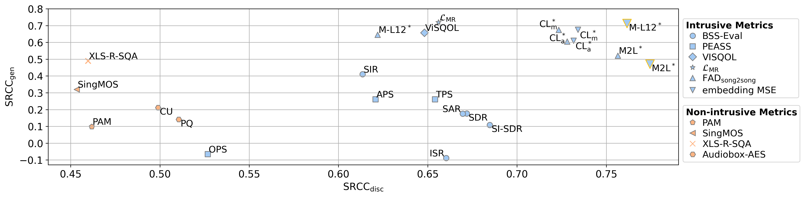

# Towards Reliable Objective Evaluation Metrics for Generative Singing Voice Separation
This repository contains the code accompanying the WASPAA 2025 paper "Towards Reliable Objective Evaluation Metrics for Generative Singing Voice Separation" by Paul A. Bereuter, Benjamin Stahl, Mark D. Plumbley and Alois Sontacchi.

## ℹ️ Further information
- Paper: [Preprint](https://arxiv.org/pdf/2507.11427)
- Website: [Companion Page](https://pablebe.github.io/gensvs_eval_companion_page/) 
- Data: [](https://doi.org/10.5281/zenodo.15911723)


## 📈 Benchmark you own metrics
A simple Python script to benchmark objective metrics on our DMOS data using the paper's correlation analysis is included in the Zenodo dataset available at [](https://doi.org/10.5281/zenodo.15911723).<br>
Instructions for benchmarking your own audio quality metrics are provided in the dataset’s Readme.md file.

## 🚀 Getting Started: Conda Environment Setup
>**Note**: If you are only interested in using our DMOS data, or if you want to benchmark your metric against it, you don't need to install any environments, just follow the instructions included in the Zenodo dataset linked above.<br>

To run all of the code in this repository we recommend setting up the following 5 conda environments.  
Environments I-III are necessary to reproduce the evaluation and correlation analysis outlined in the paper and environments IV-V are necessary to infer and train all models.
### I. ```gensvs_eval_env```: Conda environment for computation intrusive and non-intrusive metrics and correlation analysis
For evaluating the model's performance using the intrusive and non-intrusive metrics of the paper, as well as exporting all plots and the *.csv-files of the paper. We recommend setting up an additional conda environment with:
1. Create the conda environment:  
```$ ./env_info/svs_eval_env.yml``` 

2. Install additional python dependencies:  
```$ ./env_info/svs_eval_env.txt```
3. Build the ViSQOL API according to instructions of https://github.com/google/visqol and place in folder within the root directory
   - >**Note:** URL and SHA256 of Armadillo headers in the file "WORKSPACE" need to be changed to a recent version (https://sourceforge.net/projects/arma/files/)
4. To compute metrics with the PEASS-toolkit in the folder ```./01_evaluation_and_correlation/peass_v2.0.1``` Matlab (version<2025a) is required to execute Python's Matlab engine   

### II. ```gensvs_fad_mse_eval_env```: Conda environment for evaluation intrusive embedding-based metrics
For evaluating the model's performance using the proposed FAD and MSE evaluation metrics an additional conda environment has to be set up. This conda envirnonment builds on Microsoft's Frechet Audio Distance Toolkit [5].
1. Create the conda environment:
```$ conda env create -f ./env_info/svs_fad_mse_eval_env.yml``` 
2. Install additional python dependencies:
```$ pip install -r ./env_info/svs_fad_mse_eval_env.txt```  
3. Test fadtk installation with: ```$ python -m fadtk.test```

### III. ```gensvs_eval_baseline_env```: Conda environment for training and inference of **HTDemucs** and **MelRoFo (S)** 
1. Create the conda environment:  
```$ conda env create -f ./env_info/mss_baseline_env_conda.yml```  
2. Install additional python dependencies:  
```$ pip install -r ./env_info/mss_baseline_env_requirements.txt```

### IV. ```gensvs_eval_sgmsvs_env```: Conda environment for training and inference of **SGMSVS** model
1. Set the ```CUDA_HOME```environment variable in ```env_info/sgmsvs_env_conda.yml``` to path where the CUDA toolkit is installed. This can be the path where conda environment will be located
2. Create the conda environment:   
```$ conda env create -f ./env_info/sgmsvs_env_conda.yml```
3. Install additional python dependencies:  
```$ pip install -r ./env_info/sgmsvs_env.txt```

### V. ```gensvs_eval_bigvgan_env```: Conda environment for training/finetuning and inference of **MelRoFo (S)+BigVGAN**
1. Set ```CUDA_HOME```environment variable in ```env_info/sgmsvs_env_conda.yml``` to path where conda environment will be located
2. Create the conda environment:  
```$ conda env create -f ./env_info/bigvgan_env.yml```
3. Install additional python dependencies:  
```$ pip install -r ./env_info/bigvgan_env_requirements.txt```

## 🧮 Evaluation and Correlation Analysis
  

Within the folder ```01_evaluation_and_correlation``` all code to compute all objective evaluation metrics, the evaluation of the DCR test results and the correlation analysis of the paper are collected.

All metrics, listening test results, DMOS ratings, and the audio used for both metric computation and loudness-normalized listening tests are available on Zenodo: [](https://doi.org/10.5281/zenodo.15911723), where a single CSV file combines all computed metrics, DMOS ratings, and individual ratings for each audio sample. The dataset also includes instructions and an example Python script to help you benchmark your own audio quality metric by calculating correlation coefficients on our dataset. If you are only interested in the final data, you can ignore the individual CSV files located in the ```./04_evaluation_data``` folder, as they reflect intermediate steps during the paper’s development.

### Reproduce the evaluation carried out in the paper 
If you really want to look into how we calculated all metrics follow the steps below: 

### Compute Objective Evaluation Metrics
To calculate all objective metrics mentioned in the paper three python scripts are necessary. The evaluation of PAM as well as the FAD & MSE metrics are carried out in separate scripts. For the computation of the FAD & MSE metrics the conda environment ```gensvs_fad_mse_eval_env``` is necessary. All other metrics can be computed with the ```gensvs_eval_env```.

#### Compute FAD & MSE metrics 
To compute the FAD and MSE metrics we modified the code of Microsoft's fadtk [5]. The modified code can be found in ```./01_evaluation_and_correlation/fadtk_mod```.
The metrics can be computed with a python script. To show how the evaluation script is called we have added a examplary bash scripts.
- Python: ```./01_evaluation_and_correlation/gensvs_eval_fad_mse.py```
- Bash: ```$ ./01_evaluation_and_correlation/gensvs_eval_fad_mse.sh```
- Required Conda environments:
   - II. ```gensvs_fad_mse_eval_env```
#### Compute PAM scores
To compute the PAM scores of https://github.com/soham97/PAM please use the following scripts:
- Python: ```./01_evaluation_and_correlation/gensvs_eval_pam.py```
- Bash: ```$ 01_evaluation_and_correlation/gensvs_eval_pam.sh```
- Required Conda environments:
   - I. ```gensvs_eval_env```
#### Compute all other non-intrusive and intrusive metrics (BSS-Eval, PEASS, SINGMOS, XLS-R-SQA, Audiobox-AES)
To compute all other metrics mentioned in the paper please use
- Python: ```./01_evaluation_and_correlation/gensvs_eval_metrics.py```
- Bash: ```$ ./01_evaluation_and_correlation/gensvs_eval_metrics.sh```
- Required Conda environments:
   - I. ```gensvs_eval_env```
### Subjective Evaluation and correlation analysis
In order to evaluate the DMOS data, reproduce the correlation analysis results and export all the plots and *.csv files, the Python script can be executed under:
- Python: ```./01_evaluation_and_correlation/gensvs_eval_plots_and_csv_export.py```
- Required Conda environments:
   - I. ```gensvs_eval_env```

## 🏋🏽‍♀️🏃🏽‍♀️‍➡️ Training and Inference
The folder ```00_training_and_inference``` contains all code required to carry out training and inference for all the models mentioned in the paper. 

### Trained models
 - HTDemucs, MelRoFo (S), SGMSVS and the finetuned BigVGAN checkpoints (generator and discriminator) can be downloaded here: https://drive.google.com/drive/folders/13D_0ciDODkNv9q5W9l2s2WsmpHlZJvnS?usp=sharing  
 - The model checkpoint for MelRoFo (L) can be downloaded from [3].

### Inference
To run all models mentioned in the paper on a folder of musical mixtures you can either use the python inference scripts or use the provided bash scripts which show how to call the python scripts:
#### Discriminative baseline models: HTDemucs, MelRoFo (S) & MelRoFo (L)
To run the mask-based baseline models on a folder of musical mixtures the following scripts can be used:  
- Python:
  - HTDemucs & MelRoFo (S): ```00_training_and_inference/inference_baseline.py```  
  - MelRoFo (L): ```00_training_and_inference/inference_melroformer_large.py```  
- Bash:
  - HTDemucs: ```$ 00_training_and_inference/infer_htdemucs.sh```
  - MelRoFo (S): ```$ 00_training_and_inference/infer_melroformer_small.sh``` 
  - MelRoFo (L): ```$ 00_training_and_inference/infer_melroformer_large.sh```

- Required Conda environment:
   - III. ```gensvs_eval_baseline_env```

#### Generative models: SGMSVS & MelRoFo (S) + BigVGAN

To run the generative models on a folder of musical mixtures the following scripts can be used:  
- Python: 
  - SGMSVS: ```00_training_and_inference/inference_sgmsvs.py```
  - MelRoFo (S) + BigVGAN: ```00_training_and_inference/inference_melroformer_small_bigvgan.py```
- Bash:
  - SGMSVS: ```$ 00_training_and_inference/infer_sgmsvs.sh```
  - MelRoFo (S) + BigVGAN: ```00_training_and_inference/infer_melroformer_small_bigvgan.sh```
- Required Conda environment:
   - SGMSVS: IV. ```gensvs_eval_sgmsvs_env```
   - MelRoFo (S) + BigVGAN: V. ```gensvs_eval_bigvgan_env```
### Training
Below the python training scripts and example bash scripts are listed for all models to reproduce all trainings and the set parameters mentioned in the paper:
#### Discriminative Baselines: HTDemucs & MelRoFo (S)
To train the dicriminative mask-based baselines use:
  - Python:
    - HTDemucs & MelRoFo (S): ```00_training_and_inference/train_baseline.py```
  - Bash: 
    - HTDemucs: ```$ 00_training_and_inference/train_htdemucs.sh```
    - MelRoFo (S): ```$ 00_training_and_inference/train_melroformer.sh```
  - Required Conda environment:
    - III. ```gensvs_eval_baseline_env```
#### Generative models: SGMSVS & MelRoFo (S) + BigVGAN
To train the SGMSVS model or task-specifically finetune BigVGAN for singing voice separation with MelRoFo (S) you can use:

- Python: 
   - SGMSVS: ```00_training_and_inference/train_sgmsvs.py```
   - MelRoFo (S) + BigVGAN: ```00_training_and_inference/train_finetune_bigvgan.py```
- Bash: 
   - SGMSVS: ```$ 00_training_and_inference/train_sgmsvs.sh```
   - MelRoFo (S) + BigVGAN: ```$ 00_training_and_inference/train_bigvgan.sh```

- Required Conda environments:
   - SGMSVS: II. ```gensvs_eval_sgmsvs_env```
   - MelRoFo (S) + BigVGAN: III. ```gensvs_eval_bigvgan_env```

## Third-party code
All third-party code is contained in separate folders, each of which is specifically listed in this README.md file, if there exist LICENSE files for these third party folders they are located within their respective directories. The third-party directories are:

- ```./00_training_and_inference/sgmsvs/sgmse``` (from [1] https://github.com/sp-uhh/sgmse)
- ```./01_evaluation_and_correlation/pam_eval``` (from https://github.com/soham97/PAM)
- ```./01_evaluation_and_correlation/peass_v2.0.1```(from https://gitlab.inria.fr/bass-db/peass/-/tree/master/v2.0.1)
- ```./00_training_and_inference/bigvgan_utils``` (from [4] https://github.com/NVIDIA/BigVGAN)
- ```./00_training_and_inference/baseline_models/backbones``` (from [2] https://github.com/ZFTurbo/Music-Source-Separation-Training and [3] https://github.com/KimberleyJensen/Mel-Band-Roformer-Vocal-Model)
## References:
These references pertain only to the code reused to set up this codebase. For more information on the origins of the models, please refer to the references within the paper.

>[1] Julius Richter, Simon Welker, Jean-Marie Lemercier, Bunlong Lay, Timo Gerkmann. "Speech Enhancement and Dereverberation with Diffusion-Based Generative Models", IEEE/ACM Transactions on Audio, Speech, and Language Processing, vol. 31, pp. 2351-2364, 2023, Git Repository: <url>https://github.com/sp-uhh/sgmse</url>
>  
>[2] Roman Solovyev, Alexander Stempkovskiy, Tatiana Habruseva. "Benchmarks and leaderboards for sound demixing tasks", 2023, Git Repository: <url>https://github.com/ZFTurbo/Music-Source-Separation-Training</url>
>
>[3] Kimberley Jensen, "Mel-Band-Roformer-Vocal-Model", 2024, Git Repository:<url>https://github.com/KimberleyJensen/Mel-Band-Roformer-Vocal-Model</url>
>
>[4] Sang-gil Lee, Wei Ping, Boris Ginsburg, Bryan Catanzaro, Sungroh Yoon, "Big{VGAN}: A Universal Neural Vocoder with Large-Scale Training", in Proc. ICLR, 2023, Git Repository: <url>https://github.com/NVIDIA/BigVGAN</url>
>
>[5] Azalea Gui, Hannes Gamper, Sebastian Braun, Dimitra Emmanouilidou, "Adapting Frechet Audio Distance for Generative Music Evaluation", in Proc. ICASSP, 2024, Git Repository: <url>https://github.com/microsoft/fadtk</url>
```bib
@article{richter2023speech,
         title={Speech Enhancement and Dereverberation with Diffusion-based Generative Models},
         author={Richter, Julius and Welker, Simon and Lemercier, Jean-Marie and Lay, Bunlong and Gerkmann, Timo},
         journal={IEEE/ACM Transactions on Audio, Speech, and Language Processing},
         volume={31},
         pages={2351-2364},
         year={2023},
         doi={10.1109/TASLP.2023.3285241}
        }
```
```bib
@misc{solovyev2023benchmarks,
      title={Benchmarks and leaderboards for sound demixing tasks}, 
      author={Roman Solovyev and Alexander Stempkovskiy and Tatiana Habruseva},
      year={2023},
      eprint={2305.07489},
      archivePrefix={arXiv},
      howpublished={\url{https://github.com/ZFTurbo/Music-Source-Separation-Training}},
      primaryClass={cs.SD},
      url={https://github.com/ZFTurbo/Music-Source-Separation-Training}
      }
```
```bib
@misc{jensen2024melbandroformer,
      author       = {Kimberley Jensen},
      title        = {Mel-Band-Roformer-Vocal-Model},
      year         = {2024},
      howpublished = {\url{https://github.com/KimberleyJensen/Mel-Band-Roformer-Vocal-Model}},
      note         = {GitHub repository},
      url          = {https://github.com/KimberleyJensen/Mel-Band-Roformer-Vocal-Model}
    }
```
```bib
@inproceedings{lee2023bigvgan,
               title={Big{VGAN}: A Universal Neural Vocoder with Large-Scale Training},
               author={Sang-gil Lee and Wei Ping and Boris Ginsburg and Bryan Catanzaro and Sungroh Yoon},
               booktitle={in Proc. ICLR, 2023},
               year={2023},
               url={https://openreview.net/forum?id=iTtGCMDEzS_}
              }
```
```bib
@inproceedings{fadtk,
               title = {Adapting Frechet Audio Distance for Generative Music Evaluation},
               author = {Azalea Gui, Hannes Gamper, Sebastian Braun, Dimitra Emmanouilidou},
               booktitle = {Proc. IEEE ICASSP 2024},
               year = {2024},
               url = {https://arxiv.org/abs/2311.01616},
              }
```
## Cite This Work:
Citation will be added here!
```bib
@misc{bereuter2025,
      title={Towards Reliable Objective Evaluation Metrics for Generative Singing Voice Separation Models}, 
      author={Paul A. Bereuter and Benjamin Stahl and Mark D. Plumbley and Alois Sontacchi},
      year={2025},
      eprint={2507.11427},
      archivePrefix={arXiv},
      primaryClass={eess.AS},
      url={https://arxiv.org/abs/2507.11427}, 
}
```