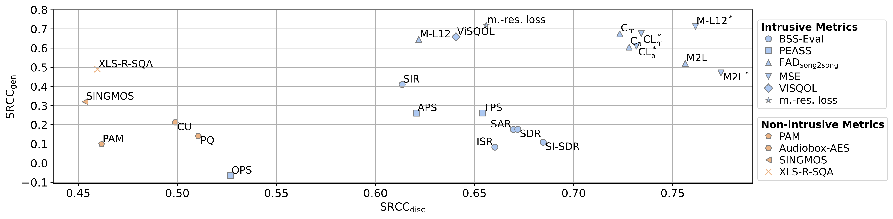

# Towards Reliable Objective Evaluation Metrics for Generative Singing Voice Separation
This repository accompanies the submission titled "Towards Reliable Objective Evaluation Metrics for Generative Singing Voice Separation".

## 🚀 Getting Started
To run all of the code in this repository we recommend setting up the following 5 conda environments.  
Environments I-III are necessary to infer and train all models mentioned in the paper and environments IV-V are necessary to reproduce the evaluation and correlation analysis outlined in the paper. 

### I. Conda environment for training and inference of **HTDemucs** and **Mel-RoFo. (S)** (```gensvs_eval_baseline_env```):
1. Create the conda environment:  
```$ conda env create -f ./env_info/mss_baseline_env_conda.yml```  
2. Install additional python dependencies:  
```$ pip install -r ./env_info/mss_baseline_env_requirements.txt```

### II. Conda environment for training and inference of **SGMSVS** model (```gensvs_eval_sgmsvs_env```):
1. Set the ```CUDA_HOME```environment variable in ```env_info/sgmsvs_env_conda.yml``` to path where the CUDA toolkit is installed. This can be the path where conda environment will be located
2. Create the conda environment:   
```$ conda env create -f ./env_info/sgmsvs_env_conda.yml```
3. Install additional python dependencies:  
```$ pip install -r ./env_info/sgmsvs_env.txt```

### IIII. Conda environment for training/finetuning and inference of **Mel-RoFo. (S)+BigVGAN** (```gensvs_eval_bigvgan_env```):
1. Set ```CUDA_HOME```environment variable in ```env_info/sgmsvs_env_conda.yml``` to path where conda environment will be located
2. Create the conda environment:  
```$ conda env create -f ./env_info/bigvgan_env.yml```
3. Install additional python dependencies:  
```$ pip install -r ./env_info/bigvgan_env_requirements.txt```

### IV. Conda environment for evaluation of FAD and MSE metrics (```gensvs_fad_mse_eval_env```):
For evaluating the model's performance using the proposed FAD and MSE evaluation metrics an additional conda environment has to be set up. This conda envirnonment builds on Microsoft's Frechet Audio Distance Toolkit [5].
1. Create the conda environment:
```$ conda env create -f ./env_info/svs_fad_mse_eval_env.yml``` 
2. Install additional python dependencies:
```$ pip install -r ./env_info/svs_fad_mse_eval_env.txt```  
3. Test fadtk installation with: ```$ python -m fadtk.test```

### V. Conda environment for evaluation of other metrics and correlation analysis (```gensvs_eval_env```)
For evaluating the model's performance using the objective evaluation metrics and reproduce the correlation analysis of the paper we recommend setting up an additional conda environment with:
1. Create the conda environment:  
```$ ./env_info/svs_eval_env.yml``` 

2. Install additional python dependencies:  
```$ ./env_info/svs_eval_env.txt```
3. Build the ViSQOL API according to instructions of https://github.com/google/visqol and place within folder within root directory
   - **Note:** URL and SHA256 of Armadillo headers in WORKSPACE file need to be changed to a recent version (https://sourceforge.net/projects/arma/files/)


In addition to the dependencies the ViSQOL API (run through command line) and a running Matlab (version<2025a) installation is required.
## 🏋🏽‍♀️🏃🏽‍♀️‍➡️ Training and Inference
The folder ```00_training_and_inference``` contains all code required to carry out training and inference for all the models mentioned in the paper. 

### Trained models
 - HTDemucs, Mel-Rofo. (S), SGMSVS and the finetuned BigVGAN checkpoints (generator and discriminator) can be downloaded here: https://drive.google.com/drive/folders/13D_0ciDODkNv9q5W9l2s2WsmpHlZJvnS?usp=sharing  
 - The model checkpoint for Mel-Rofo. (L) can be downloaded from [3].

### Inference
To run all models mentioned in the paper on a folder of musical mixtures you can either use the python inference scripts or use the provided bash scripts which show how to call the python scripts:
#### Discriminative baseline models: HTDemucs, Mel-RoFo. (S) & Mel-RoFo. (L) 
To run the mask-based baseline models on a folder of musical mixtures the following scripts can be used:  
- Python:
  - HTDemucs & Mel-RoFo. (S): ```00_training_and_inference/inference_baseline.py```  
  - Mel-RoFo. (L): ```00_training_and_inference/inference_melroformer_large.py```  
- Bash:
  - HTDemucs: ```$ 00_training_and_inference/infer_htdemucs.sh```
  - Mel-RoFo. (S):```$ 00_training_and_inference/infer_melroformer_small.sh``` 
  - Mel-RoFo. (L): ```$ 00_training_and_inference/infer_melroformer_large.sh```

#### Generative models: SGMSVS & Mel-RoFo. (S) + BigVGAN
To run the generative models on a folder of musical mixtures the following scripts can be used:  
- Python: 
  - SGMSVS: ```00_training_and_inference/inference_sgmsvs.py```
  - Mel-RoFo. (S) + BigVGAN: ```00_training_and_inference/inference_melroformer_small_bigvgan.py```
- Bash:
  - SGMSVS: ```$ 00_training_and_inference/infer_sgmsvs.sh```
  - Mel-RoFo. (S) + BigVGAN: ```00_training_and_inference/infer_melroformer_small_bigvgan.sh```
### Training
Below the python training scripts and example bash scripts are listed for all models to reproduce all trainings and the set parameters mentioned in the paper:
#### Discriminative Baselines: HTDemucs & Mel-RoFo (S)
To train the dicriminative mask-based baselines use:
  - Python: ```00_training_and_inference/train_baseline.py```
  - Bash: 
    - ```$ 00_training_and_inference/train_htdemucs.sh```
    - ```$ 00_training_and_inference/train_melroformer.sh```
#### Score-based generative model: SGMSVS
To train the SGMSVS model, use the scripts:
- Python: ```00_training_and_inference/train_sgmsvs.py```
- Bash: ```$ 00_training_and_inference/train_sgmsvs.sh```

#### GAN-based model: Mel-RoFo. (S) + BigVGAN
To task-specifically finetune BigVGAN for singing voice separation with Mel-RoFo. (S) you can use:
- Python: ```00_training_and_inference/train_finetune_bigvgan.py```
- Bash: ```$ 00_training_and_inference/train_bigvgan.sh```

## 🧮 Evaluation and Correlation Analysis
  

Within the folder ```01_evaluation_and_correlation``` all code to compute all objective evaluation metrics, the evaluation of the DCR test results and the correlation analysis of the paper are collected.

### Evaluation Data
All objective metrics are collected in a single file in ```./04_evaluation_data/objective_evaluation_metrics.csv``` and can be found individually in the folder ```./01_evaluation_and_correlation/evaluation_metrics```.   
The DMOS data can be found in ```./04_evaluation_data/dmos_data.csv```


### Compute Objective Evaluation Metrics
To calculate all objective metrics mentioned in the paper three python scripts are necessary. The evaluation of PAM as well as the FAD & MSE metrics are carried out in separate scripts. For the computation of the FAD & MSE metrics the conda environment ```gensvs_fad_mse_eval_env``` is necessary. All other metrics can be computed with the ```gensvs_eval_env```.

#### Compute FAD & MSE metrics 
To compute the FAD and MSE metrics we modified the code of Microsoft's fadtk [5]. The modified code can be found in ```./01_evaluation_and_correlation/fadtk_mod```.    
The metrics can be computed with a python script. To show how the evaluation script is called we have added a examplary bash scripts.
- Python: ```./01_evaluation_and_correlation/gensvs_eval_fad_mse.py```
- Bash: ```$ ./01_evaluation_and_correlation/gensvs_eval_fad_mse.sh```
#### Compute PAM scores
To compute the PAM scores of https://github.com/soham97/PAM please use the following scripts:
- Python: ```./01_evaluation_and_correlation/gensvs_eval_pam.py```
- Bash: ```$ 01_evaluation_and_correlation/gensvs_eval_pam.sh```
#### Compute all other non-intrusive and intrusive metrics (BSS-Eval, PEASS, SINGMOS, XLS-R-SQA, Audiobox-AES)
To compute all other metrics mentioned in the paper please use
- Python: ```./01_evaluation_and_correlation/gensvs_eval_metrics.py```
- Bash: ```$ ./01_evaluation_and_correlation/gensvs_eval_metrics.sh```

### Subjective Evaluation
In order to evaluatio the DMOS data and reproduce the correlation analysis results, we again provide the python script and an exemplary bash script:  
- Python: ```./01_evaluation_and_correlation/gensvs_eval_dmos_corr.py```
- Bash: ```./01_evaluation_and_correlation/gensvs_eval_dmos_corr.py```


## 🎼 Audio Examples
In the folder ```03_audio_examples``` 12 audio examples of each model can be found.  
The audio examples are mono and loudness normalized to -18 dBFS according to EBU R128.


## Third party code
### Third party folders
All third-party code is contained in separate folders, each of which is specifically listed in this README.md file, and the corresponding LICENSE files for each folder are located within their respective directories.

<LIST-THIRD-PARTY-CODE-HERE!>

## References:
These references pertain only to the code reused to set up this codebase. For more information on the origins of the models, please refer to the references within the paper.

>[1] Julius Richter, Simon Welker, Jean-Marie Lemercier, Bunlong Lay, Timo Gerkmann. "Speech Enhancement and Dereverberation with Diffusion-Based Generative Models", IEEE/ACM Transactions on Audio, Speech, and Language Processing, vol. 31, pp. 2351-2364, 2023, Git Repository: <url>https://github.com/sp-uhh/sgmse</url>
>  
>[2] Roman Solovyev, Alexander Stempkovskiy, Tatiana Habruseva. "Benchmarks and leaderboards for sound demixing tasks", 2023, Git Repository: <url>https://github.com/ZFTurbo/Music-Source-Separation-Training</url>
>
>[3] Kimberley Jensen, "Mel-Band-Roformer-Vocal-Model", 2024, Git Repository:<url>https://github.com/KimberleyJensen/Mel-Band-Roformer-Vocal-Model</url>
>
>[4] Sang-gil Lee, Wei Ping, Boris Ginsburg, Bryan Catanzaro, Sungroh Yoon, "Big{VGAN}: A Universal Neural Vocoder with Large-Scale Training", in Proc. ICLR, 2023, Git Repository: <url>https://github.com/NVIDIA/BigVGAN</url>
>
>[5] Azalea Gui, Hannes Gamper, Sebastian Braun, Dimitra Emmanouilidou, "Adapting Frechet Audio Distance for Generative Music Evaluation", in Proc. ICASSP, 2024, Git Repository: <url>https://github.com/microsoft/fadtk</url>
```bib
@article{richter2023speech,
         title={Speech Enhancement and Dereverberation with Diffusion-based Generative Models},
         author={Richter, Julius and Welker, Simon and Lemercier, Jean-Marie and Lay, Bunlong and Gerkmann, Timo},
         journal={IEEE/ACM Transactions on Audio, Speech, and Language Processing},
         volume={31},
         pages={2351-2364},
         year={2023},
         doi={10.1109/TASLP.2023.3285241}
        }
```
```bib
@misc{solovyev2023benchmarks,
      title={Benchmarks and leaderboards for sound demixing tasks}, 
      author={Roman Solovyev and Alexander Stempkovskiy and Tatiana Habruseva},
      year={2023},
      eprint={2305.07489},
      archivePrefix={arXiv},
      howpublished={\url{https://github.com/ZFTurbo/Music-Source-Separation-Training}},
      primaryClass={cs.SD},
      url={https://github.com/ZFTurbo/Music-Source-Separation-Training}
      }
```
```bib
@misc{jensen2024melbandroformer,
      author       = {Kimberley Jensen},
      title        = {Mel-Band-Roformer-Vocal-Model},
      year         = {2024},
      howpublished = {\url{https://github.com/KimberleyJensen/Mel-Band-Roformer-Vocal-Model}},
      note         = {GitHub repository},
      url          = {https://github.com/KimberleyJensen/Mel-Band-Roformer-Vocal-Model}
    }
```
```bib
@inproceedings{lee2023bigvgan,
               title={Big{VGAN}: A Universal Neural Vocoder with Large-Scale Training},
               author={Sang-gil Lee and Wei Ping and Boris Ginsburg and Bryan Catanzaro and Sungroh Yoon},
               booktitle={in Proc. ICLR, 2023},
               year={2023},
               url={https://openreview.net/forum?id=iTtGCMDEzS_}
              }
```
```bib
@inproceedings{fadtk,
               title = {Adapting Frechet Audio Distance for Generative Music Evaluation},
               author = {Azalea Gui, Hannes Gamper, Sebastian Braun, Dimitra Emmanouilidou},
               booktitle = {Proc. IEEE ICASSP 2024},
               year = {2024},
               url = {https://arxiv.org/abs/2311.01616},
              }
```
## Cite This Work:
Citation if paper is accepted will be added here!